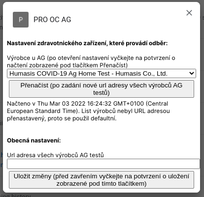

# PRO OC AG


Rozšíření přidává užitečné funkce do modulu [Pacienti COVID-19](https://ereg.ksrzis.cz/Registr/CUDZadanky/VyhledaniPacienta) a [Žádanky testů COVID-19](https://eregpublicsecure.ksrzis.cz/Registr/CUD/Overeni) s cílem usnadnit dvoufázové antigenní testování. Rozšíření nevyžaduje nainstalové žádné jiné rozšíření.

## Zásady ochrany osobních údajů

Osobní informace pacientů podmíněné přihlášením do modulu [Pacienti COVID-19](https://ereg.ksrzis.cz/Registr/CUDZadanky/VyhledaniPacienta) a webové aplikace [Žádanky testů COVID-19](https://eregpublicsecure.ksrzis.cz/Registr/CUD/Overeni) jsou použity pouze pro přidání nových funkcí zmíněných níže. Přidané funkce využívají již stávajících funkcí obou systémů. **Žádná data nejsou jakkoliv zpracovávána ani přeposílána mimo tyto systémy.**

## Použití

- Po kliknutí na vystavit AG žádanku v produkčním i testovacím modulu [Pacienti COVID-19](https://ereg.ksrzis.cz/Registr/CUDZadanky/VyhledaniPacienta) nebo registru [Žádanky testů COVID-19](https://eregpublicsecure.ksrzis.cz/Registr/CUD/Overeni) dojde na uložení dat žádanky do sdílených dat prohlížeče pro aktuálně přihlášeného uživatele. Žádanky tak jsou okamžitě jak je to možné bez nutnosti obnovovat stránku viditelné na všech zařízeních kde je daný uživatel přihlášený a rozšíření je nainstalované. Stránku s žádankami není nutné obnovovat. Na sdílené stránce se žádankami je možné potvrdit odběr, zadat negativní výsledek, vytisknout certifikát, ručně zkontrolovat žádanku v registru [Žádanky testů COVID-19](https://eregpublicsecure.ksrzis.cz/Registr/CUD/Overeni) a vyhledat profil podle zadaných údajů v modulu [Pacienti COVID-19](https://ereg.ksrzis.cz/Registr/CUDZadanky/VyhledaniPacienta).

- Pro funkčnost funkcí zmíněných výše je nutné v nastavení zadat výrobce AG testu.


## Instalace

- Pro funkčnost funkcí zmíněných výše je nutné v nastavení prohlížeče povolit vyskakování popup oken, u Firefox např. v Exceptions pro Block pop-up windows přidat ```moz-extension://<id-rozsireni>```
